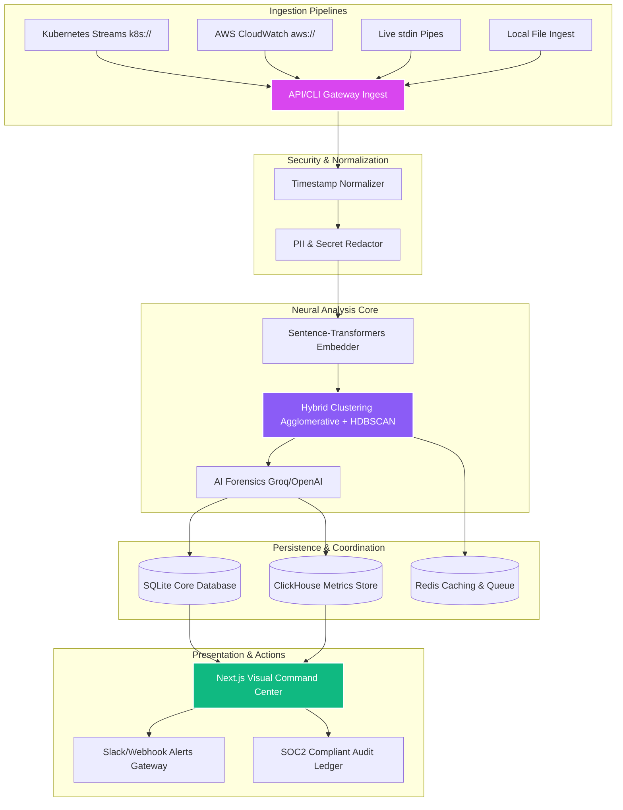

# 🛡️ SemanticOS — Neural Log Intelligence & Cluster De-Noiser

[](https://github.com/semanticos/semantic-log-denoiser/actions)
[](https://opensource.org/licenses/MIT)
[](https://python.org)
[](https://nodejs.org)
[](https://docker.com)

**SemanticOS** is an autonomous, private-by-default SRE copilot. It ingests million-line log streams from Kubernetes clusters, AWS CloudWatch, and files, normalizes timestamps, redacts PII data, and leverages **Hybrid Neural Clustering (Agglomerative + HDBSCAN)** to collapse repetitive logs by up to 99%. An integrated AI forensics engine categorizes failure domains, maps drift anomalies, and provides instant mitigation playbooks.

---

## ✨ Features Grid

| Feature | Capabilities | Emojis |
| :--- | :--- | :---: |
| **Hybrid Neural Clustering** | Combines Hierarchical Agglomerative Clustering (HAC) with HDBSCAN to discover latent log pattern densities without fragile regex templates. | 🧠 🎛️ |
| **Active Baseline Drift** | Evaluates active clusters against a "Known-Good" index baseline, highlighting newly introduced logs and regressions instantly. | 📉 ⚠️ |
| **PII & Secret Redaction** | Strips out credit card numbers, JWT tokens, AWS keys, and emails locally before any index persistence or LLM invocation. | 🔒 🧹 |
| **Cloud Native Adapters** | Direct stream extraction from live Kubernetes pods (`k8s://`), AWS CloudWatch groups (`aws://`), Docker containers, and live `stdin` pipes. | 🔌 🐳 |
| **Enterprise Dashboard** | Sleek, theme-compliant (Light/Dark) dashboard with live node vitals, sparkline metrics, forensic graph drawers, and custom toast notifications. | 📊 💻 |
| **Alerts & Integrations** | Route incident detections to Slack channels, SMTP gateways, or custom HTTP webhooks with full SOC2 audit logs. | 🔔 🔗 |

---

## 🏛️ System Architecture

The following diagram illustrates the lifecycle of log data flowing through the SemanticOS platform:



---

## 🚀 Quick Start (Enterprise Dashboard)

### Docker Compose Ingestion (Recommended)
SemanticOS comes pre-packaged with a scalable, production-ready environment configuration.

1. **Create env context file**:
   ```bash
   cp .env.example .env
   ```
2. **Launch entire platform stack**:
   ```bash
   docker-compose up -d
   ```
   This provisions and interconnects the Next.js Frontend (port `3000`), FastAPI Gateway (port `8000`), ClickHouse metrics storage, Redis message queue, and Celery analysis workers.

---

### Manual Developer Environment Setup

#### Prerequisites
- **Python 3.10+** (managed via `uv`)
- **Node.js 18+** and `npm`
- **Redis Server** (listening on localhost port 6379)

#### 1. Setup Backend Services
Create a `.env` file in the project root:
```env
LLM_API_KEY="your-api-key-here"
DATABASE_URL="sqlite:///./data/semantic_os.db"
REDIS_URL="redis://localhost:6379/0"
```

Install and start the FastAPI service + Celery worker:
```bash
# 1. Install system dependencies
uv sync

# 2. Run backend API gateway (Runs on port 8000)
PYTHONPATH=src uv run python -m uvicorn denoiser.api.main:app --host 0.0.0.0 --port 8000 --reload

# 3. Start Celery worker (in a separate terminal)
PYTHONPATH=src uv run celery -A denoiser.workers.analysis_worker.celery_app worker --loglevel=info --pool=solo
```

#### 2. Start Next.js Visual Dashboard
```bash
cd web
npm install
npm run dev
```
The dashboard is accessible instantly at **`http://localhost:3000/app`**.

---

## 🔌 API Reference Core

| Endpoint | Method | Role | Access Level |
| :--- | :---: | :--- | :---: |
| `/auth/login` | `POST` | Authenticates operator, generates ECDSA JWT bearer token. | PUBLIC |
| `/vitals` | `GET` | Live telemetry sparkline statistics for cluster node interfaces. | VIEWER |
| `/sources` | `GET` | Fetches registered log directories and cloud log buckets. | VIEWER |
| `/runs` | `POST` | Dispatches log ingestion, redacts secrets, and builds clusters. | ANALYST |
| `/runs` | `GET` | Lists historic runs, noise ratios, and compression statistics. | VIEWER |
| `/incidents` | `GET` | Retrieves active anomalous incidents and LLM failure triages. | VIEWER |
| `/incidents/{id}/resolve`| `POST` | Resolves anomalies, applies action recipes to live services. | ANALYST |
| `/audit` | `GET` | AdministrativeSOC2-compliant audit records list. | ADMIN |

---

## ⚙️ Environment Variables Reference

| Variable | Default Value | Description | Required |
| :--- | :--- | :--- | :---: |
| `LLM_API_KEY` | `""` | API credential for Groq or OpenAI neural narration engines. | **YES** |
| `DATABASE_URL` | `sqlite:///./data/semantic_os.db` | Primary relational store for configurations and user profiles. | NO |
| `REDIS_URL` | `redis://localhost:6379/0` | Key-value cache and Celery broker connection string. | **YES** |
| `CLICKHOUSE_HOST` | `localhost` | High-throughput columns storage for log telemetry ingest. | NO |
| `STORE_RAW_LOGS` | `true` | Persists original unredacted log payload in isolated volume. | NO |
| `REDACT_PII` | `true` | Enables real-time local redaction filter prior to indexing. | NO |

---

## 🤝 Contributing
We love community patches! Please review our [Contribution Guidelines](CONTRIBUTING.md) to understand linting policies (`ruff`), testing requirements (`pytest`), and standard branch naming formats.

## 📝 License
SemanticOS is licensed under the [MIT License](LICENSE).
